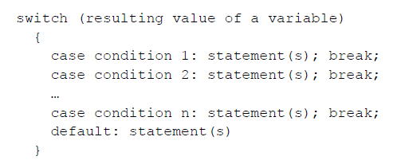
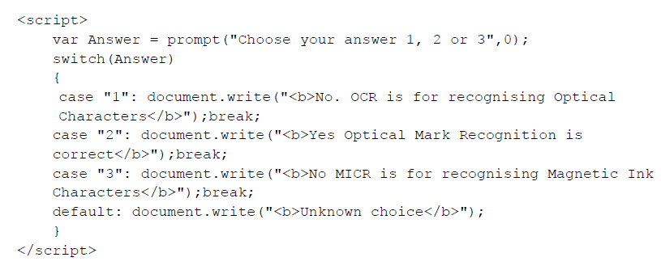
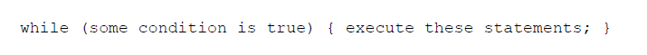
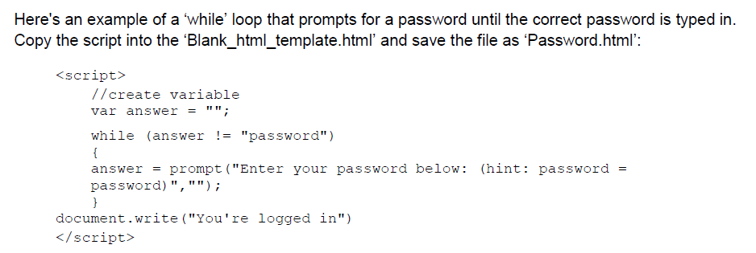
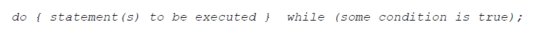
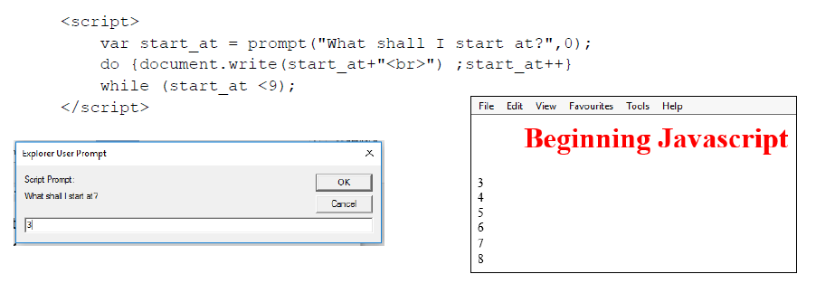
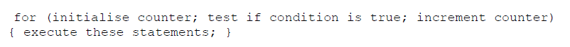
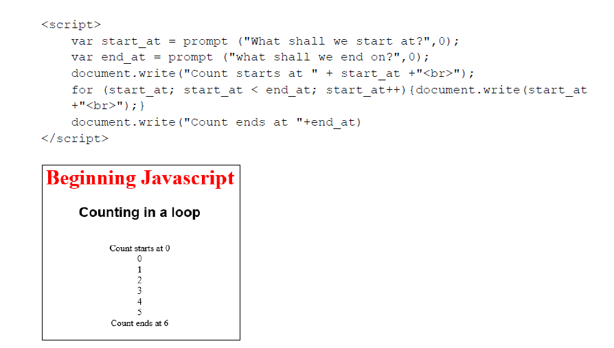
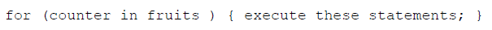
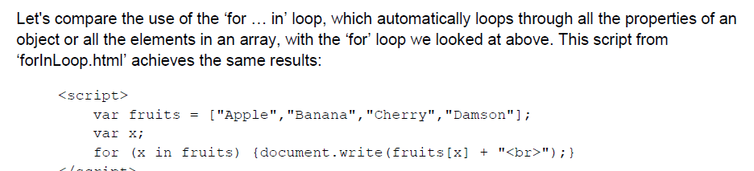

- when getting value from textbox or field remember to convert to number by multiplying by 1
- When checking is a text box is empty use
	-  "Weight.value =="" "

- _variablename_ = (_condition_) ? _value1_:_value2_
- let voteable = (age < 18) ? "Too young":"Old enough";

- if ( Weight.value == "" || Customer_ID.value == ""||Collection_Date.value == ""){
	alert("Please complete all the information")
}
- use Number() to convert to number
- Use isNan() to check if it is a number 
- Use && as and in a logical operation
- to display alert when all critea completed: first declare variable error to be equal to zero
- Then add error++ to the end of all criteria. 
- then declare an if statement at the end to see if error has more than one 
- Alert is triggered if error is equal to zero at the end.
 var error = 0
if(.....){
error++}
if(......){
error++}
if (error == 0){
}

- to get day of the week 
- __new Date(Collection_Date.value).getDay() __
- new Date(Collection_Date.value).getDay() == 0 checks if it is on a sunday. 
- remember the new
- Declare variables before use in function
	- var hello;
- If long if statement is to be used test the statements out to display alert to quickly remedy error
- Use document.getElementById('Answer1').value directly in if statement 
- always write else statement to prevent error
- when displaying text in text box ensure it has the value
	- "input id="count" type="text" value"">
- use location.reload() to reload the webpage
	- function reload(){
	location.reload()
	}
- use to reset the value to of text box to blank
	- if (first == "3"){...}{Anser.value =""}
- Always use alert to find errors easily

- use \n for line breaks in alert box
- use arrayname.length to find the length of the array
- use # toLowerCase() 
- Use console.log( typeof(variable name))
- strings can be treated like an array
- var joke="the chicken crossed the road"
- joke[5] results in "h" since it is the fifth element
- when searching string use stringname.length not stringname.length()
Error correction in Javascript

-   Add specific code to deal with the errors transparently/without affecting the web browser
    
-   Specify block of code to be tested
    
-   Add some code produce output that depends on (the type of) error encountered
    
-   The `try()` statement lets you test a block of code for errors.
    
-   The `catch()` statement lets you handle the error.
    
-   The `throw()` statement lets you create custom errors.
    
-   The `finally()` statement lets you execute code, after try and catch, regardless of the result.
    
-   Specify the text to be displayed on screen as a result of the error
    
-   [https://www.w3schools.com/js/js_errors.asp](https://www.w3schools.com/js/js_errors.asp)

Database:
- use £#,##0.00;(£#,##0.00) to change to pounds
- When using calculated field ensure the format of both fields are the same
- Dont use the "" around value being compared 
	- "(IIf([Price]<**50**))"
	- Not "(IIf([Price]<"50"))"

- Use weekday() function to calculate day of week
- Use of Require in Form build macro builder to reload the database
- in form to automatically display values from a row in another field use 
- [Fieldname].[column](column number)
- When using relationship ensure the field are the same field type
- Ensure Autonumber is linked with number

Loop Functions:

- **Case Switch **
- 
- 
\
\
\

- **While loop** 
- 
- 
- 
\
\
\

- **‘do … while’ loop**
- 
- 

\
\

- **‘for’ loop**
- 
- 

\
\

- **‘for … in’ loop**
- 
- 
- 